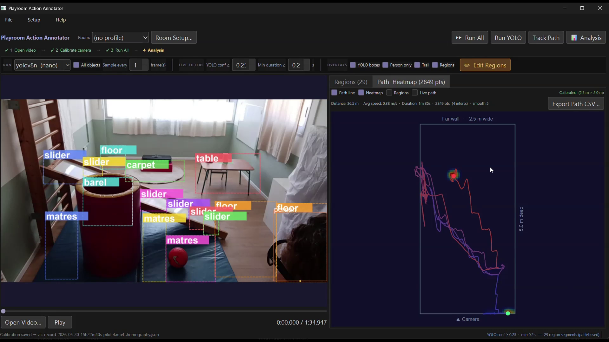

# PlayroomHAR: Playroom Behavioral Annotator

A Windows desktop application that turns a single-camera video of a child in a playroom into objective, quantitative behavioral data for ASD research: a tracked floor path, movement metrics, time spent in named room regions, dwell-time heatmaps, and a complete Excel session report.

Developed as a Software Engineering final project (26-1-D-2) at Braude College of Engineering, in collaboration with ASD researchers.



▶ [Watch the 2-minute demo video](demo_final_project_playroom_annotation.mp4)

---

## Installation

### Quick install (recommended)

The installer takes care of everything, including Python itself, so no technical knowledge is needed.

1. Download [`install.bat`](install.bat) (click the file, then the download button ⇩).
2. Double-click it and let it run. The first install downloads ~1 GB of libraries, so give it a few minutes.
3. When it finishes, a PlayroomHAR shortcut appears on your desktop. Double-click it to launch.

What the installer does: finds Python on your machine (or installs Python via winget if missing), downloads the latest app code from this repository, sets up an isolated Python environment in `%LOCALAPPDATA%\PlayroomHAR`, pre-downloads the YOLO detection model, and creates the desktop shortcut. It never touches anything outside that folder (plus the shortcut).

**Updating:** just run `install.bat` again. It fetches the latest code and keeps your environment.

**Troubleshooting:** if the app doesn't open from the shortcut, run `PlayroomHAR-debug.bat` inside `%LOCALAPPDATA%\PlayroomHAR`, which shows the error message in a console window.

**Requirements:** Windows 10/11, internet connection during install. Any modern CPU works; an NVIDIA GPU is optional but speeds up full-video runs considerably (see [GPU acceleration](#gpu-acceleration)).

### Uninstallation

The app is fully self-contained and writes nothing to the registry, so uninstalling is just deleting files:

1. Delete the folder `%LOCALAPPDATA%\PlayroomHAR` (paste that into the Explorer address bar).
2. Delete the PlayroomHAR shortcut from your desktop.

Optionally, also delete `%APPDATA%\Ultralytics` (a small settings folder created by the detection library). If the installer installed Python for you and you don't want it, remove it via Windows *Settings → Apps*.

### Manual install (for developers)

The application code lives on the `master` branch:

```bash
git clone -b master https://github.com/VictorRyskinB/PlayroomHAR
cd PlayroomHAR
python -m venv .venv
.venv\Scripts\activate
pip install -r requirements.txt
python main.py
```

Requires Python 3.10+.

#### GPU acceleration

The default install runs on CPU. For CUDA acceleration, install a CUDA-enabled PyTorch build per [pytorch.org](https://pytorch.org) into the environment before (or after) installing requirements. This is standard PyTorch procedure with no project-specific steps.

---

## Quick start

The UI is organized as a guided workflow. The step bar at the top shows where you are, and completed steps get a green check:

**1 Open video → 2 Calibrate → 3 Run All → 4 Analysis**

### One-time room setup (per camera position)

You do this once, then reuse it for every session recorded in that room:

- **Calibrate the camera:** click 4 known points on the floor in the video frame and enter their real-world positions in cm. This lets the app convert pixels into real distances and speeds.
- **Draw regions:** drag rectangles over areas of interest ("play mat", "toy shelf", …) and name them.
- **Save a room profile:** this bundles the calibration, regions, and an optional top-down blueprint image under one name. From then on, day-to-day use is: pick the profile, open the video, Run All.

### Analyzing a session

1. Open the video (file dialog or drag-and-drop; MP4/AVI/MOV/MKV/WMV).
2. Confirm the room profile in the toolbar.
3. Click **Run All** to run YOLO detection, then ByteTrack person tracking. Progress is shown and cancellable.
4. Results save automatically to `<videoname>_results.json` next to the video and reload whenever you reopen it.
5. Explore the **Regions** and **Path & Heatmap** tabs, or open the **Analysis** panel for full movement metrics. Confidence, smoothing, and duration controls are live filters: adjusting them updates everything instantly without a re-run.
6. **Export CSV** (current view) or **Export Excel** (complete styled session report).

The full manual is built into the app: **Help → User Guide**.

## What it measures

- **Movement metrics:** total distance, average speed, session duration, floor-coverage percentage, active vs. stationary episodes, speed-over-time series.
- **Region presence:** every entry/exit segment per named region, dwell time and percentage, visit count, first-visit latency.
- **Visualizations:** top-down path map (color-coded by time, dotted where interpolated) and dwell-time heatmap, optionally drawn over a room blueprint.
- **Excel session report:** one styled workbook per session with summary, rendered maps, episodes, region metrics, speed series, and raw path points. It is designed as the surface for comparing sessions across children and dates.

## How it works

- A single fixed camera (~2 m high) records the playroom. YOLOv8 detects the child in every Nth frame; ByteTrack links detections into a track, bridging occlusion gaps up to 1.5 s by interpolation (interpolated points are flagged in the data and dotted on the map).
- The child's foot position (bottom of the bounding box) is projected onto the floor plane through a one-time 4-point homography calibration, giving real-world coordinates from ordinary video.
- Capture low, filter live: YOLO always records every detection at confidence ≥ 0.05 into the results JSON; every UI threshold is a display-time filter. Tuning sensitivity never requires re-running detection.
- Pixel coordinates are the source of truth: world coordinates are always derived through the active calibration, so fixing a calibration instantly reprojects the whole path.
- The system refuses to report physical metrics (m, m/s) for uncalibrated sessions rather than output pixel-based pseudo-values.

## Repository layout

The code lives on the `master` branch; this `main` branch holds the README, the installer, and the project documents.

```
main.py                  entry point (desktop UI; deprecated CLI mode)
ui/                      PyQt6 desktop UI
  main_window.py           main window: workflow, worker threads, analysis panel
  video_player.py          OpenCV playback + overlay painting
  results_table.py         sortable/filterable results table
  path_map_widget.py       top-down floor map: path, heatmap, regions, blueprint
backend/                 no Qt imports; reusable headless
  yolo_detector.py         YOLO / YOLO-World detection (batched)
  tracking_detector.py     ByteTrack person tracking + gap interpolation
  path_analyzer.py         speed series, episodes, region stats, heatmap (the analytics core)
  homography_config.py     camera calibration save/load
  region_config.py         named regions save/load
  room_profile.py          room profile bundles
  results_format.py        per-video results JSON save/load
  excel_export.py          styled .xlsx session report
```

| File | Contents |
|---|---|
| `<video>_results.json` | All results for one video: raw detections, track points, path stats, run settings |
| `*.homography.json` | 4-point camera calibration (pixel↔cm homography + room size) |
| `*.regions.json` | Named regions in resolution-independent coordinates |
| `*.room.json` | Room profile: named references to a calibration, regions file, and blueprint |

## Project background

Behavioral ASD research commonly records a child playing in an instrumented playroom and annotates the footage by hand: which areas the child visited, what they engaged with, and for how long. PlayroomHAR automates that annotation. By design it is a measurement tool: it extracts objective behavioral metrics, and interpretation, including any diagnostic judgment, stays with the researchers.

The project originally included automatic action recognition (MMAction2) and child–object interaction labeling. After a demonstration to the research team, both were dropped: closed-vocabulary action labels ("playing with ball") cannot represent the qualitative distinctions ASD behavioral coding requires. The project was re-scoped around movement and region-engagement measurement: signals that are reliably measurable and directly useful. The deprecated subsystems are kept in the source (marked `DEPRECATED`) and working at demo level on the `demoVersionSnapshot` branch.

Full details in the project documents on this branch:

- 📘 [Project book (Phase B)](Playroom_Action_Analysis%20project%20book%20Phase%20B.docx) (includes the complete user and maintenance guides)
- 📄 [Project poster](Playroom%20Action%20Analysis%20poster.pdf)

### Authors

**Victor Ryskin** and **Niv Cohen**
Advisors: Dr. Anat Dahan, Dr. Julia Sheidin
Software Engineering Department, Braude College of Engineering
